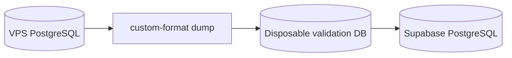

# Database portability

All domain migrations remain under `database/migrations`; there is no Supabase-only schema lineage. Apply the same ordered migrations to PostgreSQL 16 on VPS, Supabase or another compatible provider.

Migration procedure: export with `pg_dump` using `DIRECT_DATABASE_URL`; restore only into a disposable target; apply migrations twice; run integration tests; compare table counts, deterministic row hashes, FK violations, indexes, triggers, functions, RLS flags, role grants and sequence values; then perform a timed rollback rehearsal. Supabase-specific RLS/grants are additive PostgreSQL DDL and remain portable.

