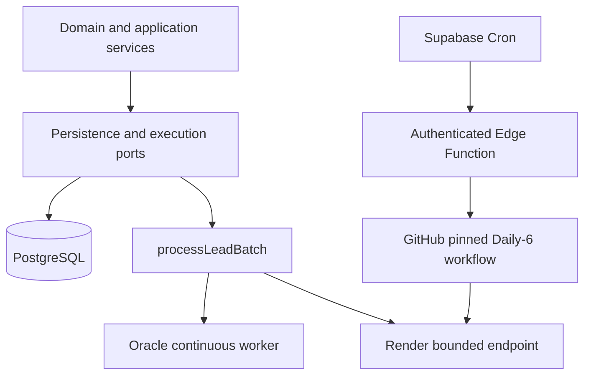
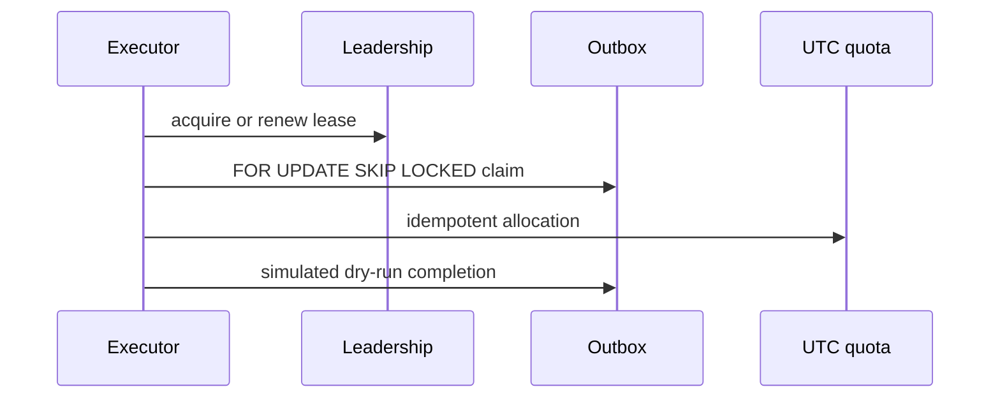

# Dual deployment architecture

Both profiles use the same TypeScript domain, PostgreSQL migrations, transactional outbox and bounded batch processor. Supabase is a PostgreSQL/cron adapter, never a domain dependency.

`processor_leadership` is the single database authority. A primary renews a lease; a standby cannot claim work. Expired leadership can be taken over with an incremented generation. Outbox claim tokens/generations prevent stale acknowledgements. `deployment_daily_lead_allocations` uniquely assigns an outbox cycle to a UTC day, while a database check makes 60 an absolute ceiling.

