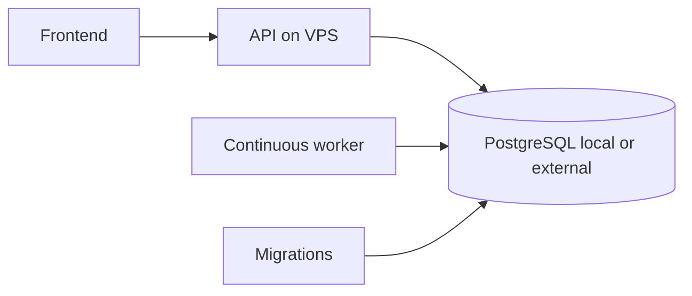

# Plan A — Oracle VPS

Plan A remains the definitive profile: continuously available API, continuous worker, configurable PostgreSQL, migrations, health/readiness, graceful shutdown, leases/retries/dead-letter and ARM64-compatible images. Use `deploy/oracle/docker-compose.oracle.yml`; enable profile `local-database` for local PostgreSQL, or set `DATABASE_URL` to a validated external PostgreSQL/Supabase session endpoint with TLS.

Secrets remain external. Keep `PROCESSOR_ROLE=standby` until the operator explicitly transfers leadership. Images build for amd64/arm64 in CI. No real provider exists in this profile.
