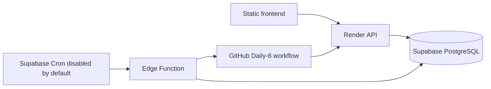

# Plan B — Supabase Free + Render Free

Render runs only the API. Supabase provides PostgreSQL and an optional Cron/Edge control-plane trigger. For native Daily-6, the Edge Function never performs discovery, provider access or delivery: it validates a dedicated bearer, claims an at-most-once dispatch identity and asks the pinned GitHub workflow to run the existing gates. GitHub remains the bounded executor; Render remains the API. Ambiguous GitHub dispatches are terminal and are never retried.

The legacy GitHub schedule and the Supabase scheduler are mutually exclusive feature flags. Cutover is performed outside every commercial window, with no queued run and with the Supabase cron job still inactive. See the [Daily-6 Supabase scheduler runbook](../runbooks/daily6-supabase-scheduler.md).

Use session pooler for the persistent Render API on IPv4-only networks. Use direct connection for migrations/pg_dump where IPv6 is available; transaction pooler is only for transient/serverless clients and requires prepared statements off. Require TLS and a pool of 3 initially. Never expose `service_role` in frontend code. All public-schema operational tables have RLS enabled and grants revoked.
