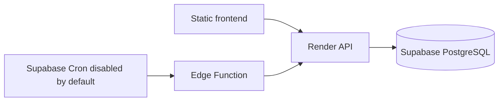

# Plan B — Supabase Free + Render Free

Render runs only the API. Supabase provides PostgreSQL and optional Cron/Edge invocation. The Edge Function is deliberately thin because the application runtime is Node.js; duplicating domain behavior in Deno would create drift. It validates a dedicated bearer secret, applies a 50-second timeout and calls one Render batch. Cold starts are safe because every claim, quota and leadership decision is persisted.

Use session pooler for the persistent Render API on IPv4-only networks. Use direct connection for migrations/pg_dump where IPv6 is available; transaction pooler is only for transient/serverless clients and requires prepared statements off. Require TLS and a pool of 3 initially. Never expose `service_role` in frontend code. All public-schema operational tables have RLS enabled and grants revoked.
