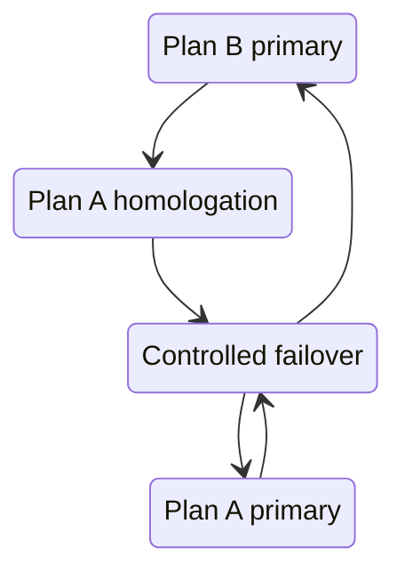

# Dual deployment operations

States:

1. Plan B active: Render API, Supabase DB, Cron + bounded batch, VPS unavailable, sends blocked.
2. Plan A homologation: VPS API/worker, Supabase or VPS DB, Render fallback, sends blocked.
3. Plan A primary: VPS API/worker and validated DB; Render/static panel is fallback.
4. Failover: set old executor `PROCESSOR_ROLE=standby`, wait for its leadership lease and outbox claims to expire, set new executor `primary`, then redirect cron/API/frontend/DNS.

Never flip DNS and processor simultaneously without observing lease expiry. Database leadership rejects split-brain; outbox claim generations reject stale completion. Keep `PUBLIC_API_URL` and CORS allowlists aligned. Cron must target only the active API. Inspect aggregate audit/queue metrics; do not log contact payloads.
