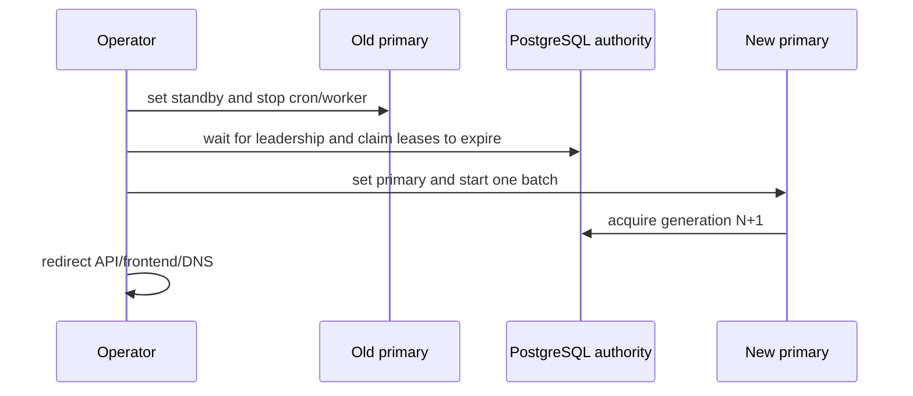

# Failover and rollback

Preconditions: current backup validated by restore; migrations identical; old cron paused; queue and dead-letter counts recorded; new `/ready` healthy. Abort if both sources report primary, migrations differ, or lease expiry cannot be proven.

Rollback uses the same sequence in reverse. Never delete leadership or outbox rows. Wait for expiration rather than forcing tokens. Restore database only into a reviewed target, compare integrity, then redirect. Real sends/providers/collection remain blocked throughout.
